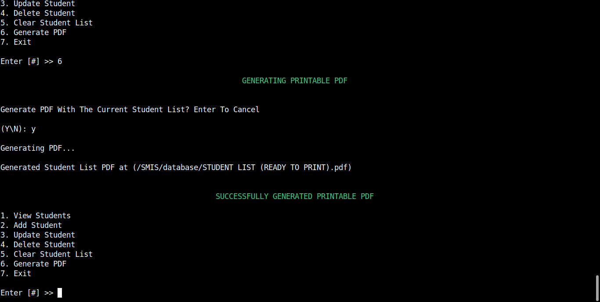

# Student Management Information System (SMIS)

  
*A simple and efficient student management system*

## 📌 Overview
The **Student Management Information System (SMIS)** is a **console-based CRUD application** that can **Read, Write, Update, Delete, and Clear** student records asynchronously. It also features **PDF generation** using QuestPDF, allowing users to create a printable document containing the list of students along with their details.

## 🚀 Features
- **Asynchronous CRUD Operations** (Create, Read, Update, Delete, Clear)
- **Student Data Storage** in JSON format
- **Enum-based Gender & Strand Categorization**
- **PDF Report Generation** using [QuestPDF](https://www.questpdf.com/)
- **Built on .NET Core 9 STS & C# 13**

## 📷 Screenshots


*Main menu of the application*


*Adding student in the list*


*Updating student in the list*


*Deleting student in the list*


*Clearing all student in the list*


*Displaying the list of students*



*Example of a generated PDF*

## 🛠️ Installation & Usage
1. **Clone the Repository**
   ```sh
   git clone https://github.com/lowizetech/SMIS.git
   cd SMIS
   ```

2. **Build the Project**
   ```sh
   dotnet build
   ```

3. **Run the Application**
   ```sh
   dotnet run
   ```

## 📂 How to Add Images in GitHub
If you already have images uploaded to GitHub, follow these steps to use them in your README:

1. Go to your repository on GitHub.
2. Open the `images/` folder (or create one if it doesn’t exist).
3. Click on the image file you uploaded.
4. Right-click on the image and **Copy Image Address (URL)**.
5. Replace the placeholders in this README with the actual image URLs:
   ```md
   
   ```

## 📜 License
This project is licensed under the **MIT License**.

---

### 👨‍💻 Author
**lowizetech**  
🔗 [GitHub Profile](https://github.com/lowizetech)


